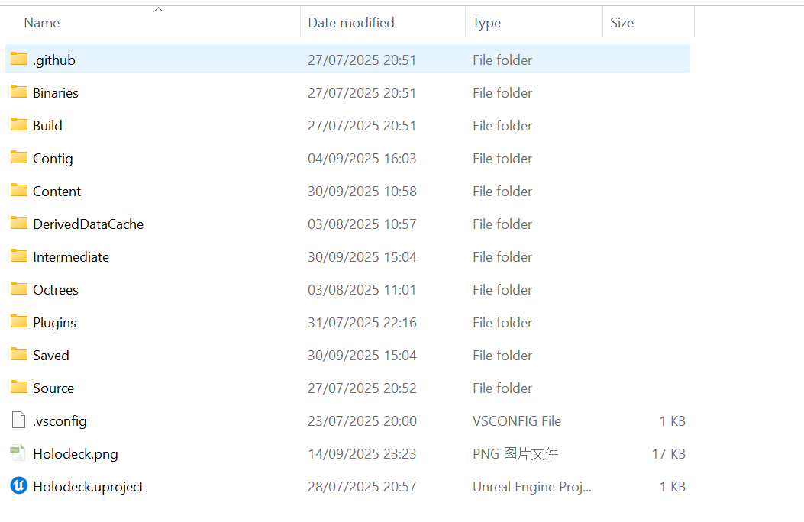
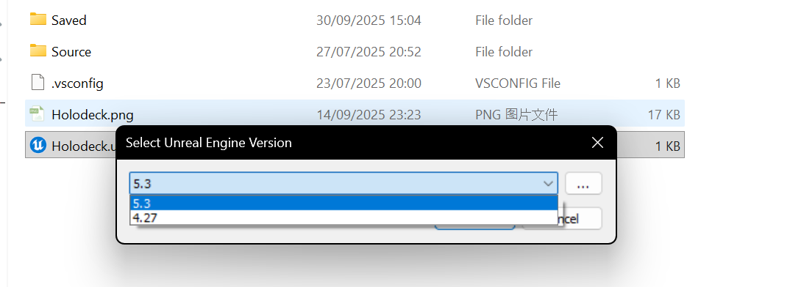
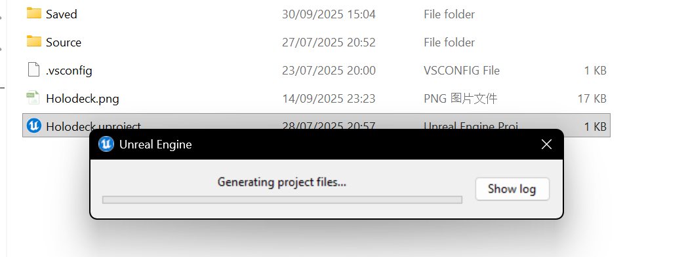
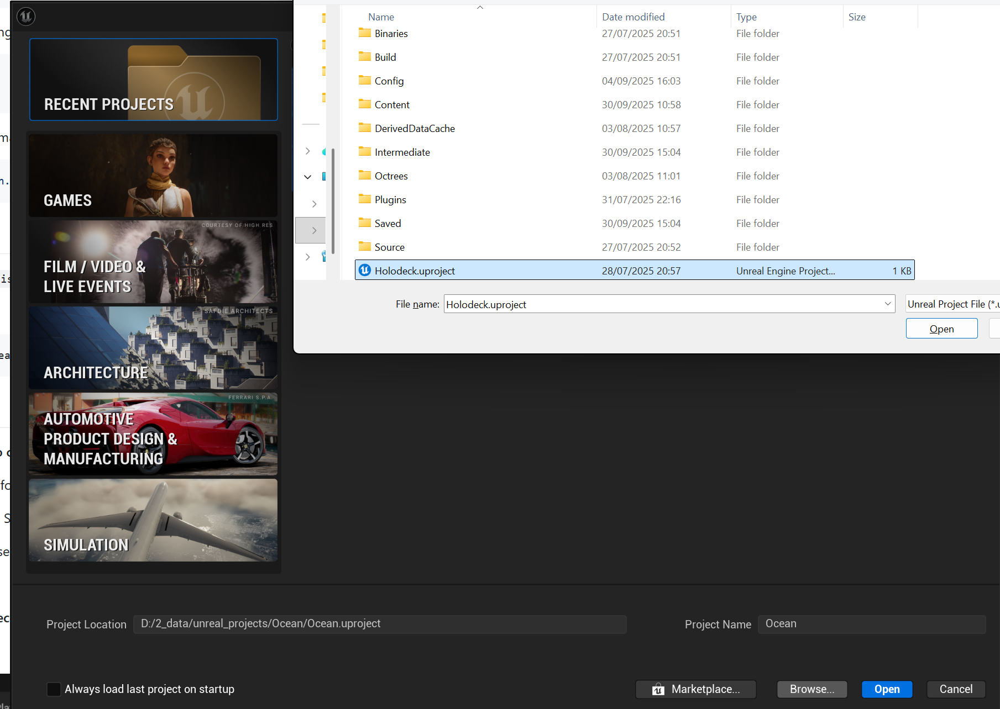
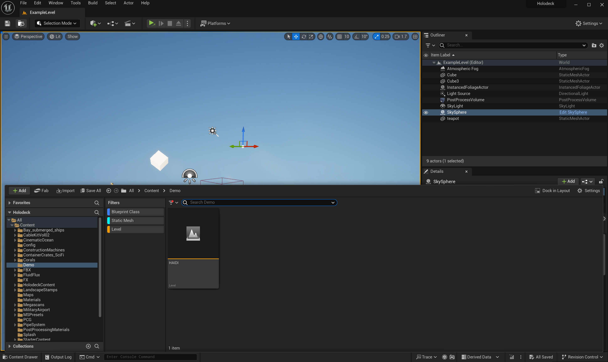
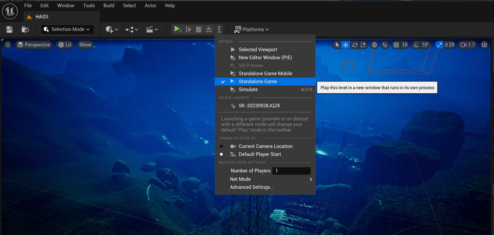

<h1 align="center"> 🌊 OceanGym 🦾 </h1>
<h3 align="center"> A Benchmark Environment for Underwater Embodied Agents </h3>

<p align="center">
  🌐 <a href="https://oceangpt.github.io/OceanGym" target="_blank">Home Page</a>
  📄 <a href="https://arxiv.org/abs/2509.26536" target="_blank">ArXiv Paper</a>
  🤗 <a href="https://huggingface.co/datasets/zjunlp/OceanGym" target="_blank">Hugging Face</a>
  ☁️ <a href="https://drive.google.com/drive/folders/1H7FTbtOCKTIEGp3R5RNsWvmxZ1oZxQih" target="_blank">Google Drive</a>
  ☁️ <a href="https://pan.baidu.com/s/19c-BeIpAG1EjMjXZHCAqPA?pwd=sgjs" target="_blank">Baidu Drive</a>
</p>

  

**OceanGym** is a high-fidelity embodied underwater environment that simulates a realistic ocean setting with diverse scenes. As illustrated in figure, OceanGym establishes a robust benchmark for evaluating autonomous agents through a series of challenging tasks, encompassing various perception analyses and decision-making navigation. The platform facilitates these evaluations by supporting multi-modal perception and providing action spaces for continuous control.

# 💐 Acknowledgement

OceanGym environment is built upon Unreal Engine (UE) 5.3, with certain components developed by drawing inspiration from and partially based on [HoloOcean](https://github.com/byu-holoocean). We sincerely acknowledge their valuable contribution.


# 🔔 News

- 10-2025, we released the initial version of OceanGym along with the accompanying [paper](https://arxiv.org/abs/2509.26536).
- 04-2025, we launched the OceanGym project.

---

**Contents:**
- [💐 Acknowledgement](#-acknowledgement)
- [🔔 News](#-news)
- [📺 Quick Start](#-quick-start)
  - [Decision Task](#decision-task)
  - [Perception Task](#perception-task)
- [⚙️ Set up Environment](#️-set-up-environment)
  - [Clone HoloOcean](#clone-holoocean)
  - [Packaged Installation](#packaged-installation)
  - [Add World Files](#add-world-files)
  - [Open the World](#open-the-world)
- [🧠 Decision Task](#-decision-task)
  - [Target Object Locations](#target-object-locations)
  - [Evaluation Criteria](#evaluation-criteria)
- [👀 Perception Task](#-perception-task)
  - [Using the Bench to Eval](#using-the-bench-to-eval)
    - [Import Data](#import-data)
    - [Set your Model Parameters](#set-your-model-parameters)
    - [Simple Multi-views](#simple-multi-views)
    - [Multi-views with Sonar](#multi-views-with-sonar)
    - [Multi-views add Sonar Examples](#multi-views-add-sonar-examples)
  - [Collecting Image Data](#collecting-image-data)
    - [Modify Configuration File](#modify-configuration-file)
    - [Collect Camera Images Only](#collect-camera-images-only)
    - [Collect Camera and Sonar Images](#collect-camera-and-sonar-images)
- [⏱️ Results](#️-results)
  - [Decision Task](#decision-task-1)
  - [Perception Task](#perception-task-1)
- [📚 Datasets](#-datasets)
- [🚩 Citation](#-citation)

# 📺 Quick Start

Install the experimental code environment using pip:

```bash
pip install -r requirements.txt
```

## Decision Task

> Only the environment is ready! Build the environment based on [here](#️-set-up-environment).

**Step 1: Run a Task Script**

   For example, to run task 4:

   ```bash
   python decision\tasks\task4.py
   ```

   Follow the keyboard instructions or switch to LLM mode for automatic decision-making.


**Step 2: Keyboard Control Guide**

   | Key         | Action                        |
   |-------------|------------------------------|
   | W           | Move Forward                 |
   | S           | Move Backward                |
   | A           | Move Left                    |
   | D           | Move Right                   |
   | J           | Turn Left                    |
   | L           | Turn Right                   |
   | I           | Move Up                      |
   | K           | Move Down                    |
   | M           | Switch to LLM Mode           |
   | Q           | Exit                         |

   > You can use WASD for movement, J/L for turning, I/K for up/down.
   > Press `M` to switch to large language model mode (may cause temporary lag).
   > Press `Q` to exit.

**Step 3: View Results**

   Logs and memory files are automatically saved in the `log/` and `memory/` directories.

**Step 4: Evaluate the results**

   Place the generated `memory` and `important_memory` files into the corresponding `point` folders.
   Then, set the evaluation paths in the `evaluate.py` file.

   We provide 6 experimental evaluation paths. In `evaluate.py`, you can configure them as follows:

   ```python
   eval_roots = [
       os.path.join(eval_root, "main", "gpt4omini"),
       os.path.join(eval_root, "main", "gemini"),
       os.path.join(eval_root, "main", "qwen"),
       os.path.join(eval_root, "migration", "gpt4o"),
       os.path.join(eval_root, "migration", "qwen"),
       os.path.join(eval_root, "scale", "qwen"),
   ]
   ```

   To run the evaluation:

   ```bash
   python decision\utils\evaluate.py
   ```

   The generated results will be saved under the `\eval\decision` folder.

## Perception Task

> All commands are applicable to **Linux**, so if you using **Windows**, you need to change the corresponding path representation (especially the slash).

**Step 1: Prepare the dataset**

After downloading from [Hugging Face](https://huggingface.co/datasets/zjunlp/OceanGym/tree/main/data/perception) or [Google Drive](https://drive.google.com/drive/folders/1H7FTbtOCKTIEGp3R5RNsWvmxZ1oZxQih), put it into the `data/perception` folder.

**Step 2: Select model parameters**

| parameter | function |
| ---| --- |
| model_template | The large language model message queue template you selected. |
| model_name_or_path | If it is an API model, it is the model name; if it is a local model, it is the path. |
| api_key | If it is an API model, enter your key. |
| base_url | If it is an API model, enter its baseful URL. |

Now we only support OpenAI, Google Gemma, Qwen and OpenBMB.

```bash
MODELS_TEMPLATE="Yours"
MODEL_NAME_OR_PATH="Yours"
API_KEY="Yours"
BASE_URL="Yours"
```

**Step 3: Run the experiments**

| parameter | function |
| ---| --- |
| exp_name | Customize the name of the experiment to save the results. |
| exp_idx | Select the experiment number, or enter "all" to select all. |
| exp_json | JSON file containing the experiment label data. |
| images_dir | The folder where the experimental image data is stored. |

For the experimental types, We designed (1) multi-view perception task and (2) context-based perception task.

For the lighting conditions, We designed (1) high illumination and (2) low illumination.

For the auxiliary sonar, We designed (1) without sonar image (2) zero-shot sonar image and (3) sonar image with few sonar example.

Such as this command is used to evaluate the **multi-view** perception task under **high** illumination:


```bash
python perception/eval/mv.py \
    --exp_name Result_MV_highLight_00 \
    --exp_idx "all" \
    --exp_json "/data/perception/highLight.json" \
    --images_dir "/data/perception/highLight" \
    --model_template $MODELS_TEMPLATE \
    --model_name_or_path $MODEL_NAME_OR_PATH \
    --api_key $API_KEY \
    --base_url $BASE_URL
```

For more patterns about perception tasks, please read [this](#-perception-task) part carefully.

# ⚙️ Set up Environment

This project is based on the HoloOcean environment. 💐

> We have placed a simplified version here. If you encounter any detailed issues, please refer to the [original installation document](https://byu-holoocean.github.io/holoocean-docs/v2.1.0/usage/installation.html).


## Clone HoloOcean

Make sure your GitHub account is linked to an **Epic Games** account, please Follow the steps [here](https://www.unrealengine.com/en-US/ue-on-github) and remember to accept the email invitation from Epic Games.

After that clone HoloOcean:

```bash
git clone git@github.com:byu-holoocean/HoloOcean.git holoocean
```

## Packaged Installation

1. Additional Requirements

For the build-essential package for Linux, you can run the following console command:

```bash
sudo apt install build-essential
```

2. Python Library

From the cloned repository, install the Python package by doing the following:

```bash
cd holoocean/client
pip install .
```

3. Worlds Packages

To install the most recent version of the Ocean worlds package, open a Python shell by typing the following and hit enter:

```bash
python
```

Install the package by running the following Python commands:

```python
import holoocean
holoocean.install("Ocean")
```

To do these steps in a single console command, use:

```bash
python -c "import holoocean; holoocean.install('Ocean')"
```

## Add World Files

Place the JSON config file from `asset/decision/map_config` or `asset\perception\map_config` into some place like:

(Windows)

```
C:\Users\Windows\AppData\Local\holoocean\2.0.0\worlds\Ocean
```

## Open the World

**1. If you're use it in first time, you have to compile it**

  1-1. find the Holodeck.uproject in **engine** folder
  
  

  1-2. Right-click and select:Generate Visual Studio project files
  
  

  1-3. If the version is not 5.3.2,please choose the Switch Unreal Engine Version
  
  

  1-4. Then open the project
  
  

**2. Then find the `HAIDI` map in `demo` directory**

  

**3. Run the project**

  

# 🧠 Decision Task

> All commands are applicable to **Windows** only, because it requires full support from the `UE5 Engine`.

The decision experiment can be run with reference to the [Quick Start](#-quick-start).

## Target Object Locations

We have provided eight tasks. For specific task descriptions, please refer to the [paper](https://arxiv.org/abs/2509.26536).

The following are the coordinates for each target object in the environment (in meters):

- **MINING ROBOT**:
  (-71, 149, -61), (325, -47, -83)
- **OIL PIPELINE**:
  (345, -165, -32), (539, -233, -42), (207, -30, -66)
- **OIL DRUM**:
  (447, -203, -98)
- **SUNKEN SHIP**:
  (429, -151, -69), (78, -11, -47)
- **ELECTRICAL BOX**:
  (168, 168, -65)
- **WIND POWER STATION**:
  (207, -30, -66)
- **AIRCRAFT WRECKAGE**:
  (40, -9, -54), (296, 78, -70), (292, -186, -67)
- **H-MARKED LANDING PLATFORM**:
  (267, 33, -80)

---

## Evaluation Criteria

1. If the target is not found, use the final stopping position for evaluation.
2. If the target is found, use the closest distance to any target point.
3. For found targets:
   - Minimum distance ≤ 30: full score
   - 30 < distance < 100: score decreases proportionally
   - Distance ≥ 100: score is 0
4. Score composition:
   - One point: 100
   - Two points: 60 / 40
   - Three points: 60 / 20 / 20

# 👀 Perception Task

## Using the Bench to Eval

> All commands are applicable to **Linux**, so if you using **Windows**, you need to change the corresponding path representation (especially the slash).
>
> Now we only support OpenAI, Google Gemma, Qwen and OpenBMB. If you need to customize the model, please contact the author.

### Import Data

First, you need download our data from [Hugging Face](https://huggingface.co/datasets/zjunlp/OceanGym) or [Google Drive](https://drive.google.com/drive/folders/1H7FTbtOCKTIEGp3R5RNsWvmxZ1oZxQih).

And then create a new `data` folder in the project root directory:

```bash
mkdir -p data/perception
```

Finally, put the downloaded data into the corresponding folder.

### Set your Model Parameters

Just open a terminal in the root directory and set it directly.

| parameter | function |
| ---| --- |
| model_template | The large language model message queue template you selected. |
| model_name_or_path | If it is an API model, it is the model name; if it is a local model, it is the path. |
| api_key | If it is an API model, enter your key. |
| base_url | If it is an API model, enter its baseful URL. |

```bash
MODELS_TEMPLATE="Yours"
MODEL_NAME_OR_PATH="Yours"
API_KEY="Yours"
BASE_URL="Yours"
```

### Simple Multi-views

All of these scripts evaluate the perception task, and the parameters are as follows:

| parameter | function |
| ---| --- |
| exp_name | Customize the name of the experiment to save the results. |
| exp_idx | Select the experiment number, or enter "all" to select all. |
| exp_json | JSON file containing the experiment label data. |
| images_dir | The folder where the experimental image data is stored. |

This command is used to evaluate the **multi-view** perception task under **high** illumination:

```bash
python perception/eval/mv.py \
    --exp_name Result_MV_highLight_00 \
    --exp_idx "all" \
    --exp_json "/data/perception/highLight.json" \
    --images_dir "/data/perception/highLight" \
    --model_template $MODELS_TEMPLATE \
    --model_name_or_path $MODEL_NAME_OR_PATH \
    --api_key $API_KEY \
    --base_url $BASE_URL
```

This command is used to evaluate the **context-based** perception task under **high** illumination:

```bash
python perception/eval/mv.py \
    --exp_name Result_MV_highLightContext_00 \
    --exp_idx "all" \
    --exp_json "/data/perception/highLightContext.json" \
    --images_dir "/data/perception/highLightContext" \
    --model_template $MODELS_TEMPLATE \
    --model_name_or_path $MODEL_NAME_OR_PATH \
    --api_key $API_KEY \
    --base_url $BASE_URL
```

This command is used to evaluate the **multi-view** perception task under **low** illumination:

```bash
python perception/eval/mv.py \
    --exp_name Result_MV_lowLight_00 \
    --exp_idx "all" \
    --exp_json "/data/perception/lowLight.json" \
    --images_dir "/data/perception/lowLight" \
    --model_template $MODELS_TEMPLATE \
    --model_name_or_path $MODEL_NAME_OR_PATH \
    --api_key $API_KEY \
    --base_url $BASE_URL
```

This command is used to evaluate the **context-based** perception task under **low** illumination:

```bash
python perception/eval/mv.py \
    --exp_name Result_MV_lowLightContext_00 \
    --exp_idx "all" \
    --exp_json "/data/perception/lowLightContext.json" \
    --images_dir "/data/perception/lowLightContext" \
    --model_template $MODELS_TEMPLATE \
    --model_name_or_path $MODEL_NAME_OR_PATH \
    --api_key $API_KEY \
    --base_url $BASE_URL
```

### Multi-views with Sonar

This command is used to evaluate the **multi-view** perception task under **high** illumination with **sonar** image:

```bash
python perception/eval/mvs.py \
    --exp_name Result_MVwS_highLight_00 \
    --exp_idx "all" \
    --exp_json "/data/perception/highLight.json" \
    --images_dir "/data/perception/highLight" \
    --model_template $MODELS_TEMPLATE \
    --model_name_or_path $MODEL_NAME_OR_PATH \
    --api_key $API_KEY \
    --base_url $BASE_URL
```

This command is used to evaluate the **context-based** perception task under **high** illumination with **sonar** image:

```bash
python perception/eval/mvs.py \
    --exp_name Result_MVwS_highLightContext_00 \
    --exp_idx "all" \
    --exp_json "/data/perception/highLightContext.json" \
    --images_dir "/data/perception/highLightContext" \
    --model_template $MODELS_TEMPLATE \
    --model_name_or_path $MODEL_NAME_OR_PATH \
    --api_key $API_KEY \
    --base_url $BASE_URL
```

This command is used to evaluate the **multi-view** perception task under **low** illumination with **sonar** image:

```bash
python perception/eval/mvs.py \
    --exp_name Result_MVwS_lowLight_00 \
    --exp_idx "all" \
    --exp_json "/data/perception/lowLight.json" \
    --images_dir "/data/perception/lowLight" \
    --model_template $MODELS_TEMPLATE \
    --model_name_or_path $MODEL_NAME_OR_PATH \
    --api_key $API_KEY \
    --base_url $BASE_URL
```

This command is used to evaluate the **context-based** perception task under **low** illumination with **sonar** image:

```bash
python perception/eval/mvs.py \
    --exp_name Result_MVwS_lowLightContext_00 \
    --exp_idx "all" \
    --exp_json "/data/perception/lowLightContext.json" \
    --images_dir "/data/perception/lowLightContext" \
    --model_template $MODELS_TEMPLATE \
    --model_name_or_path $MODEL_NAME_OR_PATH \
    --api_key $API_KEY \
    --base_url $BASE_URL
```

### Multi-views add Sonar Examples

This command is used to evaluate the **multi-view** perception task under **high** illumination with **sona** image **examples**:

```bash
python perception/eval/mvsex.py \
    --exp_name Result_MVwSss_highLight_00 \
    --exp_idx "all" \
    --exp_json "/data/perception/highLight.json" \
    --images_dir "/data/perception/highLight" \
    --model_template $MODELS_TEMPLATE \
    --model_name_or_path $MODEL_NAME_OR_PATH \
    --api_key $API_KEY \
    --base_url $BASE_URL
```

This command is used to evaluate the **context-based** perception task under **high** illumination with **sona** image **examples**:

```bash
python perception/eval/mvsex.py \
    --exp_name Result_MVwSss_highLightContext_00 \
    --exp_idx "all" \
    --exp_json "/data/perception/highLightContext.json" \
    --images_dir "/data/perception/highLightContext" \
    --model_template $MODELS_TEMPLATE \
    --model_name_or_path $MODEL_NAME_OR_PATH \
    --api_key $API_KEY \
    --base_url $BASE_URL
```

This command is used to evaluate the **multi-view** perception task under **low** illumination with **sona** image **examples**:

```bash
python perception/eval/mvsex.py \
    --exp_name Result_MVwSss_lowLight_00 \
    --exp_idx "all" \
    --exp_json "/data/perception/lowLight.json" \
    --images_dir "/data/perception/lowLight" \
    --model_template $MODELS_TEMPLATE \
    --model_name_or_path $MODEL_NAME_OR_PATH \
    --api_key $API_KEY \
    --base_url $BASE_URL
```

This command is used to evaluate the **context-based** perception task under **low** illumination with **sona** image **examples**:

```bash
python perception/eval/mvsex.py \
    --exp_name Result_MVwSss_lowLightContext_00 \
    --exp_idx "all" \
    --exp_json "/data/perception/lowLightContext.json" \
    --images_dir "/data/perception/lowLightContext" \
    --model_template $MODELS_TEMPLATE \
    --model_name_or_path $MODEL_NAME_OR_PATH \
    --api_key $API_KEY \
    --base_url $BASE_URL
```

## Collecting Image Data

> This part is optional. Only use when you need to collect pictures by yourself.

### Modify Configuration File

The sample configuration files can be found in `asset/perception/map_config`. You need to copy this and paste it into your HoloOcean project's configuration.

### Collect Camera Images Only

This command is used to collect **camera** images only, and the parameters are as follows:

| parameter | function |
| ---| --- |
| scenario | The name of the json configuration file you want to replace. |
| task_name | Customize the name of the experiment to save the results. |
| rgbcamera | The camera directions you can choose. If select all, enter "all". |

```bash
python perception/task/init_map.py \
    --scenario without_sonar \
    --task_name "Exp_Camera_Only" \
    --rgbcamera "all"
```

### Collect Camera and Sonar Images

This command is used to collect both **camera** images and **sonar** images at same time:

```bash
python perception/task/init_map_with_sonar.py \
    --scenario with_sonar \
    --task_name "Exp_Add_Sonar" \
    --rgbcamera "FrontCamera"
```

# ⏱️ Results

## Decision Task

  

- This table is the performance in decision tasks requiring autonomous completion by MLLM-driven agents.

## Perception Task

  

- This table is the performance of perception tasks across different models and conditions.
- Values represent accuracy percentages.
- Adding sonar means using both RGB and sonar images.

# 📚 DataSets
**The link to the dataset is as follows**\
 ☁️ <a href="https://drive.google.com/drive/folders/1VhrvhvbWvnaS4EyeyaV1fmTQ6gPo8GCN?usp=drive_link" target="_blank">Google Drive</a>
- Decision Task

```python
decision_dataset
├── main
│ ├── gpt4omini
│ │ ├── task1
│ │ │ ├── point1
│ │ │ │ ├── llm_output_...log
│ │ │ │ ├── memory_...json
│ │ │ │ └── important_memory_...json
│ │ │ └── ... (other data points like point2, point3...)
│ │ └── ... (other tasks like task2, task3...)
│ ├── gemini
│ │ └── ... (structure is the same as gpt4omini)
│ └── qwen
│ └── ... (structure is the same as gpt4omini)
│
├── migration
│ ├── gpt4o
│ │ └── ... (structure is the same as above)
│ └── qwen
│ └── ... (structure is the same as above)
│
└── scale
  ├── qwen
  └── gpt4omini
```


- Perception Task

```python
perception_dataset
├── data
│ ├── highLight
│ ├── highLightContext
│ ├── lowLight
│ ├── lowLightContext
│
└── result

```

# 🚩 Citation

If this OceanGym paper or benchmark is helpful, please kindly cite as this:

```bibtex
@misc{xue2025oceangymbenchmarkenvironmentunderwater,
      title={OceanGym: A Benchmark Environment for Underwater Embodied Agents}, 
      author={Yida Xue and Mingjun Mao and Xiangyuan Ru and Yuqi Zhu and Baochang Ren and Shuofei Qiao and Mengru Wang and Shumin Deng and Xinyu An and Ningyu Zhang and Ying Chen and Huajun Chen},
      year={2025},
      eprint={2509.26536},
      archivePrefix={arXiv},
      primaryClass={cs.CL},
      url={https://arxiv.org/abs/2509.26536}, 
}
```

💐 Thanks again!
